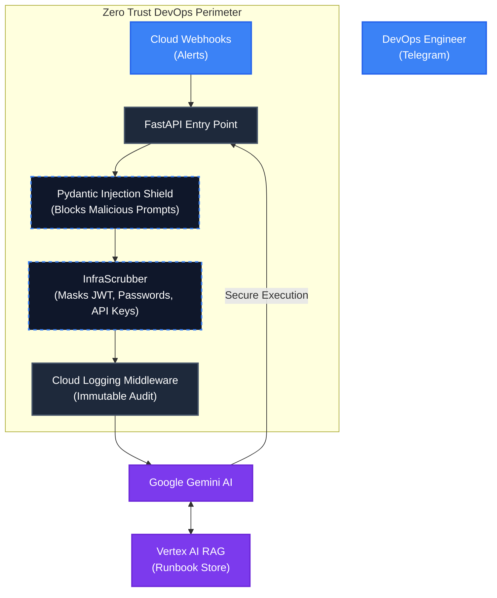

# Enterprise AI Shield: DevOps & SRE Assistant 🛡️🤖

[](https://github.com/)
[](https://www.python.org/)
[](https://cloud.google.com/)

**DevOps AI Assistant with Zero-Trust Infrastructure Protection and Vertex AI RAG integration.**

This project serves as the infrastructure and security backbone for the Enterprise AI Shield ecosystem. It provides an autonomous AI SRE (Site Reliability Engineer) that operates directly within Telegram, monitoring cloud resources, diagnosing database/vault issues, and securely executing DevOps runbooks.

---

## 🏗 Architecture & Security

Our DevOps AI Assistant is designed to be the "SRE Angel" for enterprise logistics applications (like the Zero Trust Dispatch platform). It boasts an advanced infrastructure-specific security pipeline:



---

## 🌟 Core Components

| Component | Description |
| --- | --- |
| 🛡️ **Pydantic Injection Shield** | Validates incoming commands at the FastAPI router level, blocking jailbreaks, roleplay attacks, or system prompt overrides in <1ms. |
| 🔒 **InfraScrubber** | A specialized Data Scrubber that parses raw logs and connection strings, masking DB passwords, JWT Bearer tokens, and API Keys before sending context to the LLM. |
| 🧠 **Vertex AI Agent Builder (RAG)** | Empowers the AI to consult your company's proprietary Kubernetes runbooks or ADR regulations to provide hallucination-free incident resolution. |
| 📝 **Immutable Cloud Audit** | Every request is routed through a Cloud Logging Middleware that streams structured JSON events to GCP, ensuring compliance with ISO 27001. |
| 🤖 **Multi-Step Tool Calling** | The agent can autonomously execute predefined Python functions (e.g., Slack notifications, DB queries) in a controlled loop. |

---

## 🚀 Deployment

This project is optimized for **Google Cloud Run**.

### 1. Environment Setup
Create a `.env` file in the project root:
```env
TELEGRAM_BOT_TOKEN=your_token
GCP_PROJECT_ID=your_gcp_project
GOOGLE_APPLICATION_CREDENTIALS=/path/to/key.json
```

### 2. Local Run
```bash
python -m uvicorn services.api:app --reload --host 0.0.0.0 --port 8080
```

### 3. Deploy to Cloud Run
```bash
gcloud run deploy devops-ai-assistant \
  --source . \
  --region europe-west4 \
  --allow-unauthenticated \
  --set-env-vars TELEGRAM_BOT_TOKEN="your_token"
```

---

<div align="center">
  <i>Enterprise AI Shield — DevOps and SRE Automation without compromising Security.</i>
</div>
